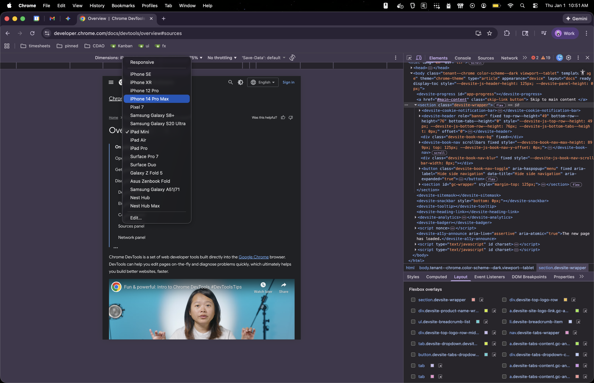

# Chrome DevTools Deep Dive

_Thu Jan 1 2026_ (Happy New Year! 🎉)

Notes from reading [this documentation](https://developer.chrome.com/docs/devtools/overview)

## What I already know

- DevTools are a panel in the browser that can show you all kinds of information about what has been sent to it. (Elements tab)
- This includes html, css, and javascript, as well as information about the network traffic itself. (Network tab)
- You can also see things stored in the browser, whether in local storage, session storage, etc. (Application tab)
- You can directly manipulate the code (html, css, js) and see changes take place.
- You can see what styles get applied from where, to debug CSS.
- Extensions enhance devtools, such as the [React Developer Tools](https://chromewebstore.google.com/detail/react-developer-tools/fmkadmapgofadopljbjfkapdkoienihi?hl=en) extension that lets you see the components of the app, not just the rendered HTML.

## Learning Goals

1. Solidify my understanding of the differences between and use-cases for Cookies, Application Storage, Session Storage, Local Storage, etc.
2. Become a pro at using the Network tab for getting info on simple requests, complicated requests, graphql, etc.
3. Know some use-cases for every tab in the panel.
4. Find 1 useful devtool extension, or think of an idea for one.
5. **Identify three concrete ways to implement what I learn today in my ATOMS UI workflow.**

## Overview

- Open by right-clicking on any browser page and selecting Inspect Element :)
- Elements tab: Can directly modify css values in the Styles, Computed etc. tabs in the extra section, and see the results show on the page.
- Device mode button allows you to specify all kinds of different devices, not just generic phone or computer



- When you get a console warning/error, you can click the filename to go to that file in the sources panel, and then can set breakpoints there. (See [this link](https://developer.chrome.com/docs/devtools/javascript/breakpoints/) for more
- You can use dev-tools as you IDE (lol) by setting up a "workspace"
- The console panel has a number of javascript "shortcuts" for faster debugging (console utils)

```
$$
$x
copy()
debug()
dir()
monitor()
```
